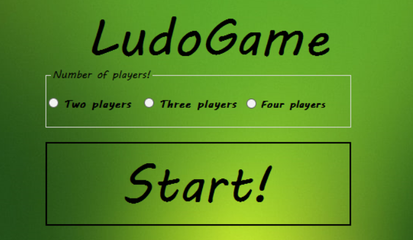
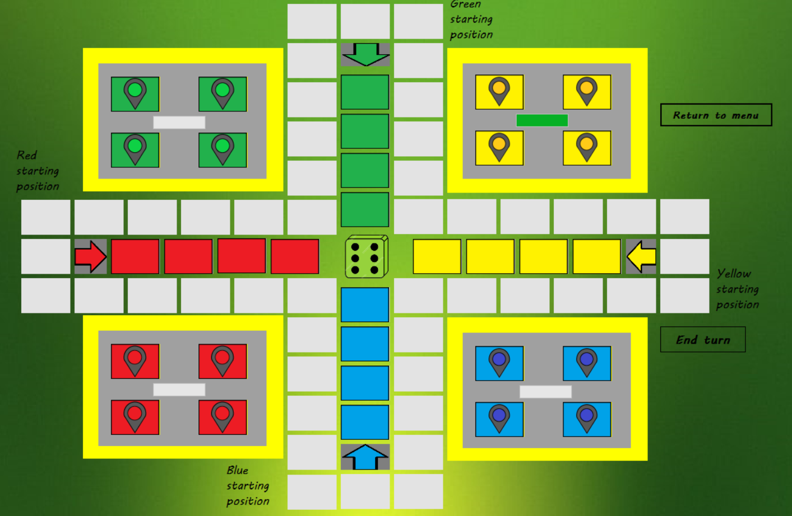
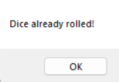

# LudoGame
Ludo project in C#-Windows forms, for the Visual Programming course in FCSE
<p>
  Created by:
  <ul>
    <li>
       Ivan Trajkov 221267
    </li>
    <li>
    Dushan Tashev 221099
    </li>
    <li>
      Teon Todorovski 221253
    </li>
  </ul>
  </p>

<h2>Опис на проблемот</h2>  
<!-- <p style="font-size: 20px">
  asdasdasdasd
</p> -->
<p>
Ова е игра која претставува имплементација на добро познатата игра за деца и возрасни "Не лути се човече" или на англиски позната како "Ludo".
За да се имплементира играта, најпрво се користени pictureboxes, кои претставуваат полиња во играта, односно секое поле, секоја фигура е еден picturebox!
<br>
За оваа цел, користено се алатки за манипулација со слики, како "Paint" и "GIMP", со цел преку фотошоп да се нацртаат полињата, фигурите врз полињата со одредена боја, стрелки и слично.
  <br>
-За подобро уживање е додадена и музика.

</p>
<h2>Упатство:</h2>
<p>
 -Апликацијата започнува со вчитување на главното мени, од каде го избираме бројот на играчи:
  
</p>
<p>
  -Играта започнува со вчитување на таблата за играње, каде што се поставуваат фигури според избраниот број на играчи.
  <p>
  -Низ текот на играта играчот ќе има можност да ги уништи фигуите на другите играчи доколку дојде врз нивното поле, со што спротивната фигура се враќа назад во почетната куќичка.
  </p>
  <p>
  -Доколку играчот не е во состојба да го мрдне својата фигура, на пример му треба 2ка за да заврши но има поголем број, потребно е да кликне врз своето поле и да го заврши потегот.
    <br>
 -Како што можеме да забележиме, редот на играчот е претставен преку loading bar, кој во согласност со тоа кој е на потег моментално, се полни до 100.
  </p>
  <p>
  
</p>
<p>
  -Играчот не смее да ја сврти коцката повторно доколку нема добиено претходно 6ка, во спротивно се појавува error.
  <br>
  
</p>
<h2>Код:</h2>
<p>
Функцијата каде се поставуваат фигурите според бројот на избрани играчи:

```csharp
    public void start()
    {
    allHomes = new List<PictureBox>
    {
        yellowHome1, yellowHome2, yellowHome3, yellowHome4,
        blueHome1, blueHome2, blueHome3, blueHome4,
        redHome1, redHome2, redHome3, redHome4,
        greenHome1, greenHome2, greenHome3, greenHome4,
    };

    Piece piece = new Piece("yellow");

    attachHomeClickEvents();

    if (numOfPlayers == 4)
    {
        string yellowImagePath = @"Assets\yellowTilePiece.png";
        List<PictureBox> yellowHomes = new List<PictureBox> { yellowHome1, yellowHome2, yellowHome3, yellowHome4 };
        loadPlayer(yellow, yellowHomes, "yellow", yellowImagePath);

        string blueImagePath = @"Assets\blueTilePiece.png";
        List<PictureBox> blueHomes = new List<PictureBox> { blueHome1, blueHome2, blueHome3, blueHome4 };
        loadPlayer(blue, blueHomes, "blue", blueImagePath);

        string redImagePath = @"Assets\redTilePiece.png";
        List<PictureBox> redHomes = new List<PictureBox> { redHome1, redHome2, redHome3, redHome4 };
        loadPlayer(red, redHomes, "red", redImagePath);

        string greenImagePath = @"Assets\greenTilePiece.png";
        List<PictureBox> greenHomes = new List<PictureBox> { greenHome1, greenHome2, greenHome3, greenHome4 };
        loadPlayer(green, greenHomes, "green", greenImagePath);
    }
    else if (numOfPlayers == 3)
    {
        string yellowImagePath = @"Assets\yellowTilePiece.png";
        List<PictureBox> yellowHomes = new List<PictureBox> { yellowHome1, yellowHome2, yellowHome3, yellowHome4 };
        loadPlayer(yellow, yellowHomes, "yellow", yellowImagePath);

        string blueImagePath = @"Assets\blueTilePiece.png";
        List<PictureBox> blueHomes = new List<PictureBox> { blueHome1, blueHome2, blueHome3, blueHome4 };
        loadPlayer(blue, blueHomes, "blue", blueImagePath);

        string redImagePath = @"Assets\redTilePiece.png";
        List<PictureBox> redHomes = new List<PictureBox> { redHome1, redHome2, redHome3, redHome4 };
        loadPlayer(red, redHomes, "red", redImagePath);
    }
    else if (numOfPlayers == 2)
    {
        string yellowImagePath = @"Assets\yellowTilePiece.png";
        List<PictureBox> yellowHomes = new List<PictureBox> { yellowHome1, yellowHome2, yellowHome3, yellowHome4 };
        loadPlayer(yellow, yellowHomes, "yellow", yellowImagePath);

        string blueImagePath = @"Assets\blueTilePiece.png";
        List<PictureBox> blueHomes = new List<PictureBox> { blueHome1, blueHome2, blueHome3, blueHome4 };
        loadPlayer(blue, blueHomes, "blue", blueImagePath);
    }

    updateUI();
    }

```
За оваа цел се користат листи од Pictureboxes, со цел да се вчитаат и подесат сите фигури и полиња, односно да се подесат сликите и tags за секој picturebox.
</p>
<hr>

<p>
  -Метод кој се повикува константно со тајмер со цел да провери дали одреден играч ги исполнил условите за победа на играта:
  <br>
  -Ова се имплементира преку проверка дали секој таг е пополнет, односно доколку на некое поле имаме tag, односно залепен објект за себе, тоа значи дека не е празно, па доколку крајните полиња не се празни, значи имаме победник!
  <br>
  
  ```csharp
  private void timer1_Tick(object sender, EventArgs e)
  {
    checkWinner(new List<PictureBox> { positionY1, positionY2, positionY3, positionY4 }, "Yellow");
    checkWinner(new List<PictureBox> { positionB1, positionB2, positionB3, positionB4 }, "Blue");
    checkWinner(new List<PictureBox> { positionG1, positionG2, positionG3, positionG4 }, "Green");
    checkWinner(new List<PictureBox> { positionR1, positionR2, positionR3, positionR4 }, "Red");
  }
private void checkWinner(List<PictureBox> homes, string playerName)
{
    int counter = 4;
    foreach (PictureBox home in homes)
    {
        if (home.Tag == null)
        {
            return;
        }
    }
    if (counter == 4)
    {
        timer1.Stop();
        MessageBox.Show($"{playerName} player has won the game,\n Congratulations!!!");
        this.Close();
    }
}
```

</p>
<p>
  -Класата Piece за фигурите:
  
```csharp
 public class Piece
 {
     public string color {  get; set; }
     public bool isAtHome {  get; set; }
     public bool isFinished {  get; set; }
     public bool passedHalf { get; set; }=false;

     public Piece(string color)
     {
         this.color = color;
         isFinished = false;
         this.isAtHome = true;
       
     }
}
```
Како што можеме да видиме овде имаме атрибути за боја, дали фигурата е пристигната до крајот во својата крајна куќичка, или пак е сеуште во почетната куќа.
<br>
Исто така се чува passedHalf, која ни овозможува полесно да се имплементира вртењето на еден круг, и влегувањето во својата куќичка имајќи во предвид дека секоја боја има различен индекс и логика за влегување во својата куќичка.
</p>
<hr>
<p>
-Дел од кодот каде што се движиме внатре во финалните куќички:
  
  ```csharp
  if (currentPlayer.name == "blue" && piece.isFinished)
                {
                    currentIndex = int.Parse(clickedPictureBox.Name.Substring(9));
                    newIndex = currentIndex + diceValue;
                    if ((currentIndex + diceValue) > 4)
                    {
                        return;
                    }
                    string newPositionName = "positionB" + newIndex;
                    PictureBox newPositionPictureBox = this.Controls.Find(newPositionName, true).FirstOrDefault() as PictureBox;
                    if (newPositionPictureBox.Tag != null)
                    {
                        return;
                    }
                    newPositionName = "positionB" + newIndex;
                    newPositionPictureBox = this.Controls.Find(newPositionName, true).FirstOrDefault() as PictureBox;
                    newPositionPictureBox.Tag = piece;
                    string pieceImagePath = @"Assets\" + piece.color + "TilePiece.png";
                    newPositionPictureBox.Image = Image.FromFile(pieceImagePath);
                    clickedPictureBox.Tag = null;
                    pieceImagePath = @"Assets\" + piece.color + "Tile.png";
                    clickedPictureBox.Image = Image.FromFile(pieceImagePath);

                }
  ```
-Овде користиме substring со цел да го добиеме индексот на pictureboxot, а потоа таа вредност ја додаваме со вредноста од коцката за да го добиеме новото поле.
-На идентичен начин функционира и движењето низ целокупната табла, но со разлики во логиката и одредувањето на кој и каде, како може да се движи.
</p>
<h2>Стратегии:</h2>
<p>
  <ul>
    <li>
      Обидете се да извадете повеќе фигури од домот за да имате повеќе опции за движење.
    </li>
    <li>
      Планирајте ги вашите потези внимателно за да ги избегнете противничките фигури.
    </li>
    <li>
      Среќно и забавувајте се играјќи Лудо(Не лути се човече)!
    </li>
  </ul>
</p>
